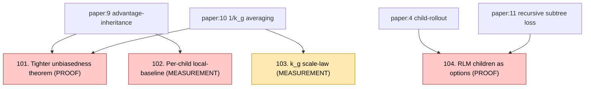

# Improvements concept graph

Four improvement proposals that build on top of the paper's ideas. Each links to a concept page (with a runnable code witness) and a validation file (proof or measurement).

## Validation modes

- **PROOF (math-flavoured improvements):**
  - 101 → [`../../proofs/inheritance-unbiasedness.tex`](../../proofs/inheritance-unbiasedness.tex)
  - 104 → [`../../proofs/rlm-as-options.tex`](../../proofs/rlm-as-options.tex)
- **MEASUREMENT (experiment-flavoured improvements):**
  - 102 → [`../../improvements/local-baseline.py`](../../improvements/local-baseline.py) (Agent C)
  - 103 → [`../../improvements/k-scale-sweep.py`](../../improvements/k-scale-sweep.py) (Agent C)

See [`../tour.md`](../tour.md) §4 "Improvements walk" for the per-improvement narrative.
