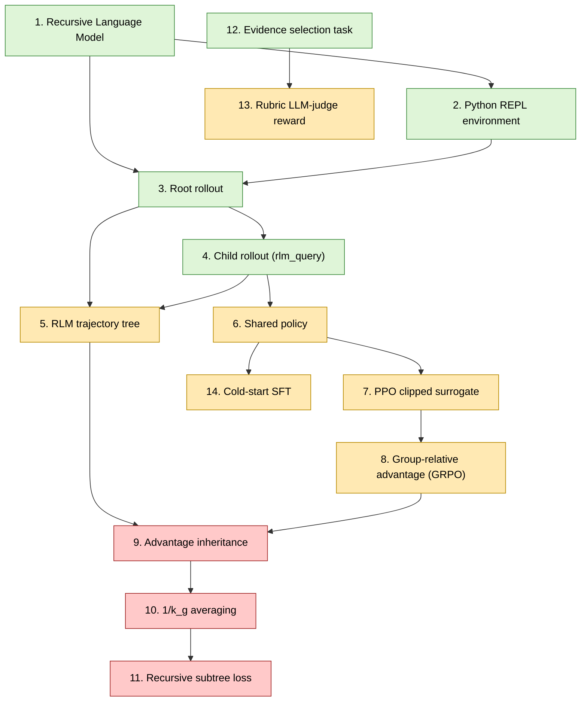

# Paper concept graph — Reinforcing Recursive Language Models

This is the dependency DAG for the 14 paper concepts. Each node links to its concept page; each concept page has an aligned `code/` runnable demo.

## Skill levels

- **intro** (green): the substrate — what an RLM rollout *is*.
- **intermediate** (amber): the standard RL machinery (PPO, GRPO, SFT) plus the shared-policy choice.
- **advanced** (red): the paper's three novel ideas — advantage inheritance, $1/k_g$ averaging, recursive subtree loss.

## Foundation prereqs (chain)

The prereqs that live *outside* this paper graph are foundational chapters of [`pleyva2004/first-principles-to-llms`](https://github.com/pleyva2004/first-principles-to-llms):

- **Ch 25** — causal LM as MDP (every node)
- **Ch 27** — tiny GPT pre-training (the policy)
- **Ch 28** — SFT, RLHF/PPO, DPO (cold-start, per-node loss)
- **Ch 29** — MDP foundations (trajectory + Bellman)
- **Ch 30** — max-ent + soft Bellman (entropy bonus)
- **Ch 31** — policy gradient, GRPO, RLHF/DPO bridge (the chapter most directly extended)

See [`../tour.md`](../tour.md) §2 "Foundations walk" for the topologically-ordered reading plan.
